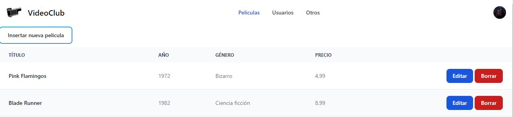

## TODO:
* Login y Registro
* Menú usuario y Admin
* Comprar/Alquilar
* Listas
* Validaciones

## Requisitos de cada punto.
* Login debe de permirtir logearse (usuario previamente creado) y mostrarle `index.php`. O lo que es lo mismo, la página principal de ususarios.

* En caso de el usuario sea admin, debe ir al apartado `index.php` de *admin*. Desde ahí puede **insertar, modificar y eliminar** las películas añadidas. También puede (aún por implementar) modificar y borrar usuarios.

* Registro debe permitir registrar y logear automáticamente si el usuario indicado no se encuentra en la base de datos y rellena correctamente todos los campos del formulario. En caso de que exista un usuario indicado en el formulario en nuestra base de datos, debe marcar un error y el formulario se pintará de rojo.

* Menú será diferente para admin y para los usuarios. Admin podrá ver películas, usuarios y otros. Permitiendo gestionar tanto las películas como los usuarios. Mientras que los usuarios solo podrán ver la lista de películas. Además del menú desplegable en su cuenta (pedidos, pendientes, visto, cerrar sesión).

* Hacer ciertas validaciones, concretamente en campos de usuarios, sesiones y en las compras. Además, y muy importante, que los pedidos y listas sean del usuario logeado y no de ningún otro.